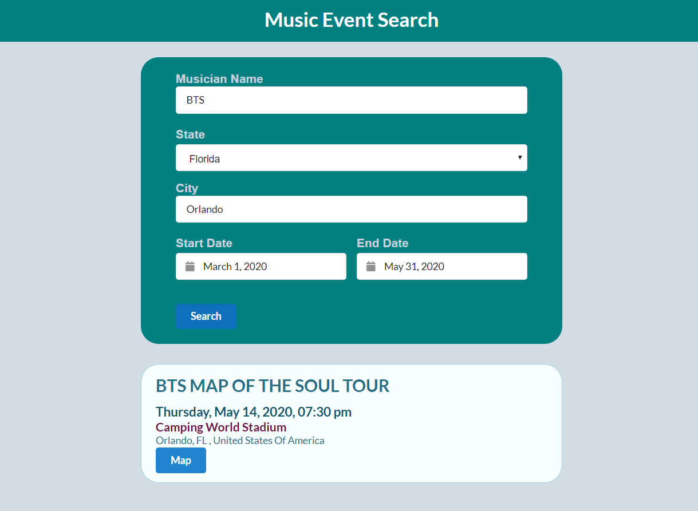
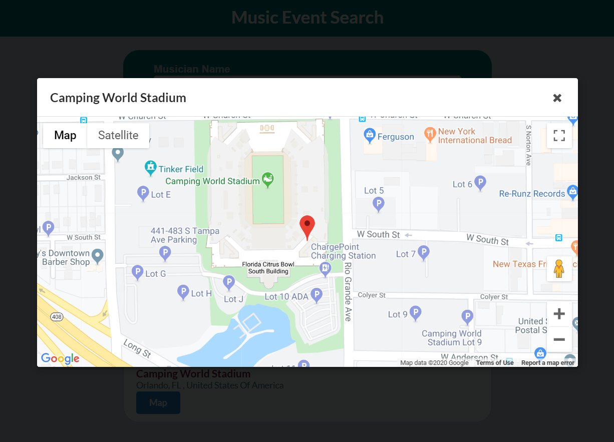

# EMA Music
A music event search app using the Tcketmaster API and Google Map Javascript API.

### Table of Contents
* General Info
* User Story
* MVP
* Product Vision
* Link
* Files
* Technologies

### General Info
This is an application to search for music events/concerts by the criterias:
* Artist / Venue name
* State
* City
* Date Range (Start Date - End Date)

List of events that meet the specified criteria is displayed by search button click.
The ticket purchasing website opens when the user click on the event listed.
When the user click on the map button on each event, it opens a modal that displays the map of the venue with a marker.

### User Story
* As a music lover, I want to search for my favorite artist's concert information, so that I can purchase the ticket and go to the event.

* As a person who is looking for an activity for to fill the free time on my bussiness trip, I want to search for events in the city, so that I can schedule the activity to enjoy the city besides work.

* As a person who likes prestesious venue experiences, I want search for concerts at the Carnegie Hall, so that I can find an excuse to go there.

### MVP
* Search criteria input
  - Artist / Venue name
  - State
  - City
  - Date
  - List of the event that meet the specified criteria
  - Link to ticket purchasing website
  - Link to venue website
  - Venue map in the modal

### Product Vision
MVP Plus the following:

Google Places API & Directions API:
* An info window in the map modal with the venue information:
  - Address
  - Phone number
  - Hours
  - Ratings
 
* Add buttons on top of the map in the modal (map header)
  - Direction button (to show the driving/walking directions)
  - Website button (to show the venue's official website)

Artist Image:
* Image of the artist in the event information division for each event

Ticketmaster:
* Sort event results by date and time in the result division

### Link
[Click here to use the EMA Music](https://emi-dev.github.io/projectEMA/)

### Files
* index.html
* style.css (under "assets/css")
* script.js.js (under "assets/js")
* README.md

### Technologies
Project is created with:
* JavaScript
* jQuery
* HTML 5
* CSS 3
* Semantic UI

API:
* Ticketmaster API
* Google Maps Javascript API
